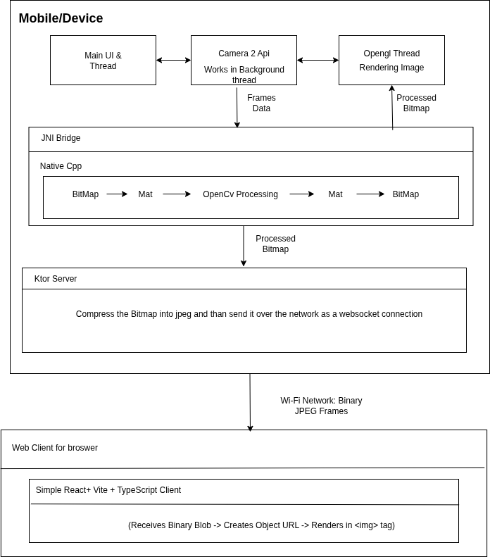

# Flam Assignment 

A full-stack Android project demonstrating real-time video processing with OpenCV/C++ and live streaming to a web browser via WebSockets. The processed feed is rendered locally using OpenGL ES.

---

## Features

### Core Functionality
* **Live Camera Feed**: Captures video using the **Android Camera2 API**.
* **Native Image Processing**: Performs real-time computer vision tasks using **OpenCV** in **C++** (connected via JNI).
* **Switchable Processing**: UI button to toggle native OpenCV effects on/off.

### Rendering
* **High-Performance Display**: Renders the video feed using **OpenGL ES 2.0** for a smooth.
* **Real-Time Shader Effects**: Applies visual effects (**Grayscale**, **Invert**) using **GLSL shaders**, controlled by a UI button.

### Networking & Web Interface
* **Embedded Web Server**: Runs a lightweight **Ktor WebSocket server** on the Android device.
* **Live Web Viewer**: A **React/TypeScript** web application that connects to the stream and displays the live feed.


## Prerequisites & Setup

### Android Setup
1.  **Install Android Studio**.
2.  Use the **SDK Manager** (`Settings` > `System Settings` > `Android SDK` > `SDK Tools`) to install:
    * SDK Platform 
    * NDK 
    * CMake

### OpenCV Setup
1.  Download **OpenCV for Android SDK** from the official site.
2.  Unzip and copy the `sdk` folder into the `app/src/main/cpp/` directory in the project Or just copy the file path and set Dir Name in Cmake File
3.  Make sure your `app/src/main/cpp/CMakeLists.txt` has this line:
    ```cmake
    set(OpenCV_DIR ${CMAKE_SOURCE_DIR}/sdk)
    ```

### Web Viewer Setup
1.  Install **Node.js**.
2.  Navigate to the web viewer's project folder and run
    ```bash
    npm install
    ```

### Hardware & Network
* You need a physical Android device with **USB Debugging enabled**.
* Connect both your computer and Android device to the **same Wi-Fi network** to make use of the WebSocket (IpAdress + Port).

## Application in Action

### 1. Live Web Stream
The core feature is the real-time stream from the Android device to the web browser. The following GIF demonstrates the processed video feed being streamed live to the web viewer over the local network.


**Canny Edge Detection**:


### 2. Android App UI & Controls
The Android app provides on-device controls for managing the processing pipeline and visual effects.


**Canny Edge Detection**:


**GrayScale**:


**Invert**:


**Canny Edge Invert**:


* **Toggle Processing**: Switches between the raw camera feed and the C++ OpenCV (edge detection) output.
* **Toggle Effect**: Cycles through Opengl effects (None, Grayscale, Invert) applied to the final render.


## Architecture Overview

The system operates on a client-server model. The Android application functions as a powerful, multi-threaded server, while the web browser hosts a lightweight client.



---

## How It Works: Detailed Flow

### 1. On the Android App (The Server)

The Android app manages complex tasks across multiple threads to ensure a responsive user experience.

* **Camera Capture**: The **Camera2 API** captures the live video feed. This stream initially goes to a `SurfaceTexture` linked to a `TextureView`.
* **Frame Extraction**: From the `TextureView`, each frame is extracted as an Android `Bitmap`.
* **Native Processing (C++ & JNI)**:
    * The `Bitmap` is passed to the native C++ layer via **JNI (Java Native Interface)**. JNI acts as a bridge, allowing Kotlin/Java to execute high-performance C++ code.
    * In C++, the `Bitmap`'s pixel data is directly accessed (zero-copy) to create an **OpenCV `cv::Mat`** object.
    * OpenCV performs the image processing (e.g., edge detection) on the `cv::Mat`.
    * The processed `cv::Mat` data is written back into an output `Bitmap` and returned to Kotlin.
* **Dual Output Stream Fork**: The processed `Bitmap` is then sent down two parallel paths:
    * **Local Display (OpenGL ES)**: The `Bitmap` is uploaded to the GPU as a texture. Our custom **OpenGL ES 2.0 renderer** (`BitmapRenderer`) displays this texture on a `GLSurfaceView`. This is also where **GLSL shaders** apply real-time visual effects (Grayscale, Invert) on the GPU.
    * **Web Broadcasting (Ktor WebSocket)**: The `Bitmap` is compressed into a smaller **JPEG `ByteArray`**. This `ByteArray` is then passed to an embedded **Ktor WebSocket server** running within the Android app.

### 2. Communication Between App and Web (WebSockets)

The connection between the Android device and the web client happens over **WebSockets**, enabling fast, continuous communication.

* **Connection Handshake**:
    * The web browser sends an initial HTTP request to the Android app's IP address (e.g., `ws://<phone-ip>:8080/video`). This request includes special headers asking to "upgrade" to a WebSocket connection.
    * The Ktor server on the Android app responds by agreeing to "switch protocols."
    * A persistent, low-latency connection (like an open phone line) is established over TCP.
* **Data Transfer**: Once connected, the Android server continuously pushes the JPEG `ByteArray` frames as binary WebSocket messages to the web client.

### 3. On the Web Browser (The Client)

The web client is a **React application** built with **TypeScript**, designed to efficiently receive and display the streamed video.

* **Connection Management**: Using React's `useEffect` hook, the app establishes a WebSocket connection when the page loads and ensures it's properly closed when the page is unloaded.
* **Frame Reception**: The `WebSocket` listener (`onmessage`) receives the incoming binary JPEG data as a `Blob` object.
* **Rendering**: `URL.createObjectURL(blob)` generates a temporary local URL for the received `Blob`. This URL is then set as the `src` attribute of an `` tag in the React component. Since this happens for every incoming frame, it creates the illusion of a smooth, live video stream in the browser.